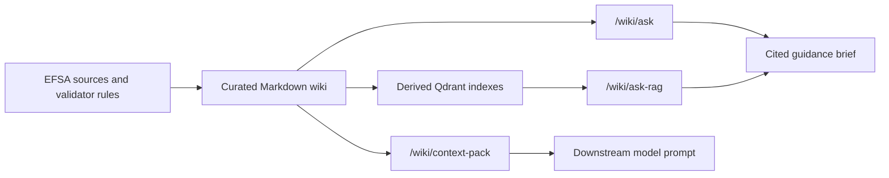

# FoodEx2 LLM Knowledge Base

A curated Markdown knowledge base and retrieval API for EFSA FoodEx2 coding guidance and validation policy.

The project keeps immutable source documents separate from concise, linked topic pages that are easier for humans and language models to retrieve, cite, and maintain.

## Status: Beta

The Markdown knowledge layer, maintenance checks, and three primary API surfaces are ready for integration testing and supervised production use:

| Endpoint | Use it for | Retrieval |
| --- | --- | --- |
| `POST /wiki/ask` | A short, cited guidance brief | LLM page selection over curated wiki pages |
| `POST /wiki/ask-rag` | The same answer shape with vector retrieval | Qdrant over curated wiki pages or raw sources |
| `POST /wiki/context-pack` | Prompt-ready page evidence for a downstream model | LLM page selection plus deterministic coverage rules |

The service provides guidance and evidence, not authoritative catalogue lookup or final validation. DMT and other downstream callers should keep candidate search, code construction, and validator checks in their own pipeline.

`/wiki/policy-pack` and `/wiki/solve` remain experimental solver-style surfaces.

## Architecture



Markdown is the authored source of truth. Qdrant collections, graph views, and API projections are rebuildable derived artifacts.

## Current Runtime Defaults

- Page selector: `claude-sonnet-5`
- Answerer for `/wiki/ask` and `/wiki/ask-rag`: `gpt-5.6-terra`
- Default page budget: 7 pages
- `/wiki/ask` graph expansion: off
- `/wiki/context-pack`: strict final page cap, including `RUNTIME_RULES.md`
- `/wiki/ask`: `index.md` is available to the selector as catalogue metadata but is not returned as answer evidence
- Anthropic selector prompts: stable instructions, tools, and page catalogue use five-minute prompt caching

Request-level `selector_model` and `answerer_model` values override the configured defaults where supported. Runtime traces report models, timings, token use, selected pages, and Anthropic cache reads/writes.

## Quick Start

Requires Python 3.12 or later.

```bash
python3 -m venv .venv
. .venv/bin/activate
pip install -r requirements.txt
cp .env.example .env
```

For the default selector and answerer, configure:

```bash
ANTHROPIC_API_KEY=...
OPENAI_API_KEY=...
WIKI_CONTEXT_MODEL=claude-sonnet-5
WIKI_ANSWERER_MODEL=gpt-5.6-terra
```

Start the API:

```bash
uvicorn wiki_api.app:app --reload --port 8010
```

Then open:

- Health: `http://127.0.0.1:8010/health`
- OpenAPI: `http://127.0.0.1:8010/docs`
- Wiki viewer: `http://127.0.0.1:8010/wiki/view`
- Graph viewer: `http://127.0.0.1:8010/wiki/graph-view`

Example guidance request:

```bash
curl -s http://127.0.0.1:8010/wiki/ask \
  -H 'Content-Type: application/json' \
  -d '{
    "question": "What should I consider when reporting sheep urine?",
    "max_pages": 7,
    "include_page_content": false
  }'
```

The canonical request and response contracts are published at `GET /openapi.json`.

## Choosing an Endpoint

Use `/wiki/ask` when a compact strategy brief should guide candidate search or downstream reasoning. It selects curated pages, synthesizes an answer, and returns direct citations.

Use `/wiki/ask-rag` to compare vector retrieval with page selection. Set `retrieval_mode` to:

- `wiki` for the curated Markdown collection
- `source` for immutable source-document chunks

For wiki retrieval, `retrieval_strategy: "diverse_pages"` treats `limit` as a unique-page budget. The compatibility default remains `legacy_topk`.

Use `/wiki/context-pack` when another model will do the principal reasoning. It returns `RUNTIME_RULES.md`, selected guidance pages, the policy contract, and trace metadata without synthesizing a final answer.

All three surfaces enforce their configured page budget. Related-page expansion on `/wiki/ask` is opt-in and cannot exceed `max_pages`.

## Qdrant RAG

`/wiki/ask-rag` requires Qdrant and a Voyage embedding key:

```bash
VOYAGE_API_KEY=...
QDRANT_URL=http://127.0.0.1:6333
```

Build or refresh the curated wiki collection:

```bash
.venv/bin/python scripts/index_wiki_qdrant.py \
  --collection foodex2_wiki_markdown_v1 \
  --delete-orphans
```

Build the separate raw-source collection when source-level comparison is needed:

```bash
.venv/bin/python scripts/index_source_qdrant.py \
  --collection foodex2_source_docs_v1 \
  --recreate
```

Check whether the live wiki index matches the current Markdown:

```bash
.venv/bin/python scripts/wiki_rag_status.py
# or
.venv/bin/python -m wiki_api.doctor --check-rag-index
```

The same deterministic status is exposed at `GET /wiki/rag/status`.

## Model and RAG Evaluation

Compare answer models while holding the question constant:

```bash
.venv/bin/python scripts/wiki_ask_model_sweep.py \
  --question "What should I think about when reporting chicken plasma in VMPR?" \
  --selector-model claude-sonnet-5 \
  --answerer-models claude-sonnet-5,claude-haiku-4-5,gpt-5.6-terra,gpt-5.6-luna \
  --max-pages 7
```

Compare `/wiki/ask` with `/wiki/ask-rag` on reviewed DMT questions:

```bash
.venv/bin/python scripts/wiki_ragas_eval.py \
  --cases evals/wiki-rag/dmt_end_to_end_cases.json \
  --label dmt-comparison \
  --answerer-models claude-sonnet-5,claude-haiku-4-5,gpt-5.6-terra,gpt-5.6-luna \
  --only-reviewed \
  --dry-run
```

Always inspect the dry run before removing `--dry-run`; endpoint calls and judge-model calls multiply across cases, endpoints, and models. See [evals/wiki-rag/README.md](evals/wiki-rag/README.md) for dataset rules, scoring, and result interpretation.

Source-driven coverage evaluation is separate from these witness tests. It generates
versioned questions from authoritative EFSA documents, treats gaps as the output rather
than a merge failure, and defaults to local LM Studio models. See
[evals/coverage/README.md](evals/coverage/README.md).

## Local Models

The API can route LLM work through an OpenAI-compatible LM Studio server:

```bash
WIKI_LLM_PROVIDER=lmstudio
WIKI_LMSTUDIO_BASE_URL=http://127.0.0.1:1234/v1
WIKI_LMSTUDIO_MODEL=your-local-model-id
```

When this provider is enabled, the local model replaces endpoint-specific hosted model defaults. Page-selection and solver-style flows require reliable tool calling.

## Repository Layout

```text
foodex2_docs/          Immutable source documents
raw/efsa-guidance/     Curated topic and validation pages
wiki_api/              FastAPI retrieval service
evals/                 Reviewed evaluation datasets and methodology
scripts/               Indexing, evaluation, and maintenance utilities
reports/               Generated audit and evaluation output
index.md               Human and selector-facing content catalogue
RUNTIME_RULES.md       Compact prompt-facing rules
log.md                 Chronological knowledge-base changes
```

## Updating the Wiki

1. Preserve new source documents under `foodex2_docs/`.
2. Update concise topic pages under `raw/efsa-guidance/` with source attribution.
3. Update `index.md` when pages are added, removed, renamed, or re-scoped.
4. Record material semantic changes in `log.md`.
5. Rebuild the Qdrant wiki index if prompt-facing Markdown changed.
6. Run the doctor and tests.

```bash
.venv/bin/python -m wiki_api.doctor
.venv/bin/pytest -q
```

The doctor checks catalogue registration, links, page categories, prompt projections, graph connectivity, and source references. Semantic changes should remain human-reviewed; maintenance automation reports drift but does not rewrite or merge knowledge.

## Operations

Install the versioned macOS LaunchAgent for a persistent local service:

```bash
./deploy/launchd/install-foodex2-wiki-launchagent.sh
```

The installer prints the reload commands. Service output is written to:

```text
/tmp/foodex2_wiki_8010.out.log
/tmp/foodex2_wiki_8010.err.log
```

## Documentation

- [PROJECT_CONTEXT.md](PROJECT_CONTEXT.md): project rationale
- [KNOWLEDGE_ARCHITECTURE.md](KNOWLEDGE_ARCHITECTURE.md): knowledge and retrieval architecture
- [WIKI_ARCHITECTURE_FOR_MODELS.md](WIKI_ARCHITECTURE_FOR_MODELS.md): model-facing system map
- [INGEST_WORKFLOW.md](INGEST_WORKFLOW.md): source-ingest procedure
- [MAINTENANCE_WORKFLOW.md](MAINTENANCE_WORKFLOW.md): deterministic and LLM-assisted maintenance
- [SCHEMA.md](SCHEMA.md): page metadata and linking conventions
- [log.md](log.md): chronological changes and historical operational notes

## Related Projects

- [DMT](https://github.com/Chili36/DMT): downstream application consuming wiki guidance and context
- [automatic-couscous](https://github.com/Chili36/automatic-couscous): FoodEx2 validator supplying operational rule context
- [Chemmon_Wiki](https://github.com/Chili36/Chemmon_Wiki): companion Chemical Monitoring guidance wiki

## Scope

The beta focuses on FoodEx2 coding guidance and validation logic. It does not cover the full EFSA data-submission workflow, and the discontinued Smart Coding App is intentionally excluded.
