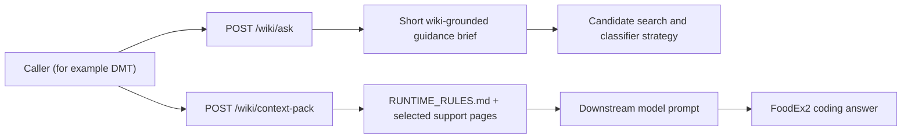
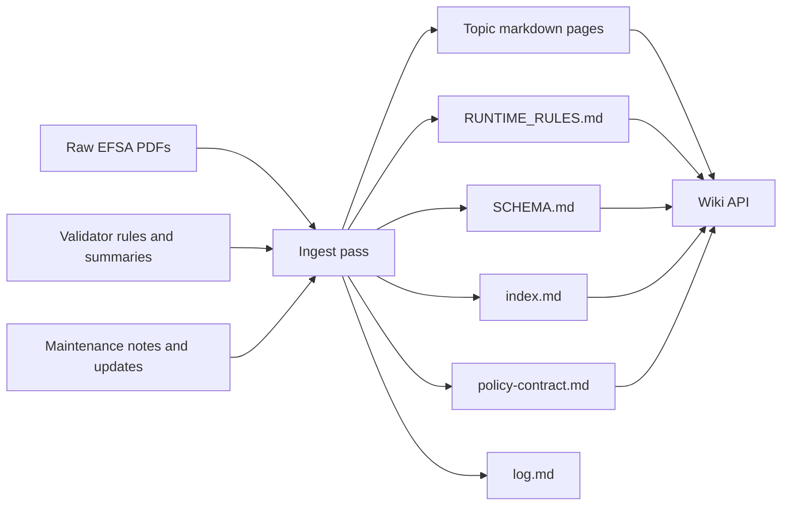

# LLM Knowledge Base

This repository contains a structured markdown knowledge base for EFSA FoodEx2 guidance and FoodEx2 validation policy.

It follows the "LLM wiki" pattern: raw source documents stay immutable, while an LLM incrementally builds and maintains a topic-oriented markdown layer that is easier to read, search, cite, and update over time.

See [PROJECT_CONTEXT.md](PROJECT_CONTEXT.md) for the project rationale and the connection to Andrej Karpathy's `llm-wiki` gist. See [KNOWLEDGE_ARCHITECTURE.md](KNOWLEDGE_ARCHITECTURE.md) for the current architecture stance on compiled markdown knowledge, graph retrieval, long-source ingest, and why heavier RAG infrastructure is deferred. See [MAINTENANCE_WORKFLOW.md](MAINTENANCE_WORKFLOW.md) for the deterministic and LLM-assisted maintenance loop.

## Related Projects

- [automatic-couscous](https://github.com/Chili36/automatic-couscous): the FoodEx2 validator project that supplies the operational rule layer reflected in parts of this wiki.
- [Chemmon_Wiki](https://github.com/Chili36/Chemmon_Wiki): the companion wiki focused on Chemical Monitoring guidance and reporting-specific interpretation.
- [DMT](https://github.com/Chili36/DMT): the downstream application that consumes this wiki API for context, policy, and solving workflows.

## Current Status

Yes: the wiki layer has been created.

This project is now at an early alpha stage.

The wiki API has three practical runtime surfaces that are stable enough to try:

1. `POST /wiki/ask` for a compact guidance brief. This is useful when the caller wants a short "what should I think about?" answer before or during candidate retrieval.
2. `POST /wiki/ask-rag` for a compact guidance brief from a Qdrant corpus. This is useful for A/B testing curated wiki markdown retrieval against raw source-document retrieval while keeping the same answer shape as `/wiki/ask`.
3. `POST /wiki/context-pack` for prompt-ready page evidence. This is useful when the caller wants selected wiki pages, runtime rules, and trace metadata to place into its own downstream prompt.

The service also exposes `GET /wiki/rag/status`, a deterministic health endpoint for the curated markdown Qdrant index. It compares the current markdown-derived chunks with the live collection and reports missing, stale, orphaned, or embedding-mismatched chunks without using an LLM.

The default production stance is still not "wiki-owned solving". The current focus is wiki-backed guidance and prompt context delivery. `POST /wiki/solve` exists for experiments where the wiki service is allowed to make the final FoodEx2 coding decision, but downstream classifiers such as DMT should usually keep final code construction and validation in their own pipeline.

Validator and catalogue status:

- The sibling FoodEx2 validator has an MTX `17.1` update in its current PR stream, moving from MTX `17.0` to `17.1`. The MTX `17.1` import is `PUBLISHED MINOR`, imported 2026-06-06, with 31,690 terms and last EFSA update date 2026-04-28.
- `BR13` should be read as a seven-code disintegration-family restriction on `F03` for raw commodities, not as "all physical-state facets are invalid on raw commodities".
- `BR19` can differ from stock ICT when the validator loads transparent `BR19+` extension rows for stale `BR_Data.csv` coverage gaps. Set `STRICT_ICT_PARITY=1` in the validator when strict stock-ICT behaviour is required.
- `BR26` is a known divergence: stock ICT and the sibling validator are effectively silent in the observed state, though for different implementation reasons. Same-ordinal process stacking should still be treated cautiously even when BR26 does not fire.

At the moment, the repository contains:

- Immutable source PDFs in [foodex2_docs](foodex2_docs)
- LLM-maintained topic pages in [raw/efsa-guidance](raw/efsa-guidance)
- A content index in [index.md](index.md)
- A knowledge architecture decision page in [KNOWLEDGE_ARCHITECTURE.md](KNOWLEDGE_ARCHITECTURE.md)
- A maintenance workflow in [MAINTENANCE_WORKFLOW.md](MAINTENANCE_WORKFLOW.md)
- A chronological wiki log in [log.md](log.md)
- A validator-rule layer distilled from the sibling `Foodex2 Code Validator` project
- A local FastAPI retrieval service in `wiki_api/` so client applications can request selected wiki context from this repo instead of owning wiki navigation themselves

The current wiki pages include:

- [foodex2-overview.md](raw/efsa-guidance/foodex2-overview.md)
- [base-term-selection.md](raw/efsa-guidance/base-term-selection.md)
- [facet-coding-rules.md](raw/efsa-guidance/facet-coding-rules.md)
- [implicit-vs-explicit-facets.md](raw/efsa-guidance/implicit-vs-explicit-facets.md)
- [code-string-format.md](raw/efsa-guidance/code-string-format.md)
- [process-facets.md](raw/efsa-guidance/process-facets.md)
- [ingredient-facets.md](raw/efsa-guidance/ingredient-facets.md)
- [packaging-facets.md](raw/efsa-guidance/packaging-facets.md)
- [chemical-monitoring-foodex2.md](raw/efsa-guidance/chemical-monitoring-foodex2.md)
- [pesticides-foodex2.md](raw/efsa-guidance/pesticides-foodex2.md)
- [contaminants-foodex2.md](raw/efsa-guidance/contaminants-foodex2.md)
- [domoic-acid-scallops.md](raw/efsa-guidance/domoic-acid-scallops.md)
- [vmpr-foodex2.md](raw/efsa-guidance/vmpr-foodex2.md)
- [vmpr-legislative-mapping.md](raw/efsa-guidance/vmpr-legislative-mapping.md)
- [additives-flavourings-foodex2.md](raw/efsa-guidance/additives-flavourings-foodex2.md)
- [validation-rules.md](raw/efsa-guidance/validation-rules.md)
- [structural-validation.md](raw/efsa-guidance/structural-validation.md)
- [term-type-facet-constraints.md](raw/efsa-guidance/term-type-facet-constraints.md)
- [process-validation-rules.md](raw/efsa-guidance/process-validation-rules.md)
- [domain-specific-validation.md](raw/efsa-guidance/domain-specific-validation.md)
- [maintenance-history.md](raw/efsa-guidance/maintenance-history.md)
- [maintenance-2015.md](raw/efsa-guidance/maintenance-2015.md)
- [maintenance-2016-2018.md](raw/efsa-guidance/maintenance-2016-2018.md)
- [maintenance-2019.md](raw/efsa-guidance/maintenance-2019.md)
- [maintenance-2020.md](raw/efsa-guidance/maintenance-2020.md)
- [maintenance-2021.md](raw/efsa-guidance/maintenance-2021.md)
- [maintenance-2022.md](raw/efsa-guidance/maintenance-2022.md)
- [maintenance-2023.md](raw/efsa-guidance/maintenance-2023.md)
- [maintenance-2024.md](raw/efsa-guidance/maintenance-2024.md)

Added since initial bootstrap:

- A formal ingest workflow document in [INGEST_WORKFLOW.md](INGEST_WORKFLOW.md)
- A schema document in [SCHEMA.md](SCHEMA.md)
- A compact runtime rules file in [RUNTIME_RULES.md](RUNTIME_RULES.md)
- An architecture stance in [KNOWLEDGE_ARCHITECTURE.md](KNOWLEDGE_ARCHITECTURE.md) that keeps markdown and the derived graph as the primary knowledge layer while treating long-document indexing as an ingest aid.
- A deterministic maintenance doctor and supervised LLM lint workflow in [MAINTENANCE_WORKFLOW.md](MAINTENANCE_WORKFLOW.md).
- Deterministic Qdrant wiki-index drift checks in `scripts/wiki_rag_status.py`, `GET /wiki/rag/status`, and `python -m wiki_api.doctor --check-rag-index`.

## Alpha Architecture

This repo has four practical layers:

- Source layer: immutable EFSA PDFs and validator-derived rule sources
- Knowledge layer: topic pages under `raw/efsa-guidance/`
- Retrieval layer: the FastAPI wiki service in `wiki_api/`
- Caller layer: an external application such as DMT that requests pages and packs them into a prompt

The architecture decision is deliberately conservative. Because FoodEx2 source updates are rare, the repo should treat compiled pages, authored links, graph-derived retrieval, source traceability, and regression tests as the primary knowledge system. A local Qdrant index can be built from those markdown pages for A/B retrieval tests, but it is a derived runtime artifact rather than a replacement source of truth. Long-document techniques such as tree summaries or long-context retrieval belong in ingest and source-audit workflows first; the durable runtime unit remains the curated wiki page.

At the moment, the two most important runtime paths are:



`/wiki/ask` is a compact strategy layer. It answers from selected wiki pages and citations, but it is not an authoritative catalogue or validator.

`/wiki/context-pack` is a page-evidence layer. It returns selected page content so another classifier can build its own prompt and make the final decision against candidate terms and validator output.

The content-building path looks like this:



## Directory Layout

```text
foodex2_docs/
  Raw EFSA PDF sources

raw/efsa-guidance/
  Topic-oriented markdown knowledge pages derived from the PDFs,
  including guidance pages, validator-rule pages, and annual maintenance pages

wiki_api/
  FastAPI service exposing the wiki catalog, raw page reads, and
  adaptive retrieval and solver endpoints for external clients such as DMT
```

## Page Conventions

Each wiki page should:

- Use YAML frontmatter
- List source PDFs
- Include related-page links
- Keep source-page comments such as `<!-- Source: ... -->`
- Stay concise and scannable
- Attribute claims to source pages or sections
- Prefer topic pages over document dumps

## How This Is Intended To Work

1. Add new EFSA or related source files to `foodex2_docs/`.
2. Read those sources and extract durable rules, examples, and terminology.
3. Update or create topic pages under `raw/efsa-guidance/`.
4. Keep the markdown layer as the default working surface for future FoodEx2 coding questions.
5. Use the PDFs and validator sources as the source of truth whenever a claim needs verification.

For the concrete ingest method, use [INGEST_WORKFLOW.md](INGEST_WORKFLOW.md).

## Ingest Flow

The ingest process is deliberately simple:

1. keep the raw documents unchanged
2. distill them into topic pages that are easier for humans and models to navigate
3. connect those topic pages into a dense enough graph that a selector can find the right subset
4. expose those pages through a retrieval API without moving the source of truth into service code

In practice, an ingest or update pass should do all of the following:

- preserve the original PDFs and validator-derived sources unchanged
- update or create topic pages in `raw/efsa-guidance/`
- add or maintain frontmatter fields such as `title`, `sources`, `related`, and `last_updated`
- use optional `source_tier` only when authority matters; allowed values are `authoritative_rule`, `expert_guidance`, `local_policy`, and `diagnostic`
- add inline cross-links so related concepts can be discovered by humans and selectors
- add a `Relevant Business Rules` section when `BRxx` rules materially constrain that page
- add a `Relevant Policy` section when decision order matters for that page
- update [index.md](index.md) so the selector sees accurate summaries and keywords
- record the change in [log.md](log.md) when the update is material
- run the wiki doctor before publishing material wiki changes

The practical goal is not to mirror the PDFs page-by-page. The goal is to produce a usable markdown layer that lets a caller retrieve the right guidance pages for a concrete coding case.

## Knowledge Base Shape

The knowledge base is intentionally not flat even though it is stored as markdown files.

It has a few recurring page types:

- orientation and schema pages such as [SCHEMA.md](SCHEMA.md)
- architecture pages such as [KNOWLEDGE_ARCHITECTURE.md](KNOWLEDGE_ARCHITECTURE.md)
- compact runtime pages such as [RUNTIME_RULES.md](RUNTIME_RULES.md)
- orientation pages such as [foodex2-overview.md](raw/efsa-guidance/foodex2-overview.md)
- operational guidance pages such as [base-term-selection.md](raw/efsa-guidance/base-term-selection.md) and [implicit-vs-explicit-facets.md](raw/efsa-guidance/implicit-vs-explicit-facets.md)
- validator-facing rule pages such as [business-rules.md](raw/efsa-guidance/business-rules.md) and [process-validation-rules.md](raw/efsa-guidance/process-validation-rules.md)
- conditional domain overlays such as [pesticides-foodex2.md](raw/efsa-guidance/pesticides-foodex2.md), [contaminants-foodex2.md](raw/efsa-guidance/contaminants-foodex2.md), [domoic-acid-scallops.md](raw/efsa-guidance/domoic-acid-scallops.md), [vmpr-foodex2.md](raw/efsa-guidance/vmpr-foodex2.md), [additives-flavourings-foodex2.md](raw/efsa-guidance/additives-flavourings-foodex2.md), and [domain-specific-validation.md](raw/efsa-guidance/domain-specific-validation.md)
- maintenance pages that explain yearly changes
- one richer control-layer page: [policy-contract.md](raw/efsa-guidance/policy-contract.md)

The runtime rules page and the policy page are both still markdown in the repo. They are not secret service-side prompts. The API reads them from the repo and exposes them as normal wiki content.

The repo also has a lightweight relationship model rather than a flat pile of pages: frontmatter `related` links, inline `[[...]]` cross-links, `Relevant Policy` sections, `Relevant Business Rules` sections, and `index.md` as the main hub. The details are documented in [SCHEMA.md](SCHEMA.md).

## What Context-Pack Does

`POST /wiki/context-pack` is the alpha endpoint to understand first.

Its purpose is narrow:

- take a coding case
- choose a small set of wiki pages with the internal page selector
- return those pages so the caller can pack them into its own prompt

The intended caller pattern is:

1. search externally and build a candidate list
2. call `/wiki/context-pack`
3. receive the selected wiki pages
4. place those pages into a downstream prompt
5. let the downstream model do the final coding

That means this repo currently behaves more like a context service than a full autonomous coding service.

## What We Always Attach

For the simple `context-pack` path, the API always attaches the compact runtime layer before the ordinary guidance pages.

In practice, the caller receives:

- `guiding_principles` derived from [index.md](index.md)
- `policy_contract` parsed from [policy-contract.md](raw/efsa-guidance/policy-contract.md)
- `pages_used`
- `pages`, with [RUNTIME_RULES.md](RUNTIME_RULES.md) forced to the top
- `trace` metadata

The important design decision is that the runtime and policy layers are still markdown-backed. The JSON `policy_contract` field is a convenience view for callers that want structure, but the canonical source of truth remains the markdown pages themselves.

Business rules are not blindly attached on every request. Instead, the knowledge pages are expected to backlink the `BRxx` rules that materially constrain them, and the selector should return the right support pages for the case at hand.

## Wiki API

This repo now owns the wiki retrieval surface. Client applications should call this service instead of re-implementing wiki selection logic elsewhere.

Create and use the repo-local environment:

```bash
python3 -m venv .venv
. .venv/bin/activate
pip install -r requirements.txt
```

Then edit [`.env.example`](.env.example) into a local `.env`, or edit the generated [`.env`](.env) directly:

```bash
cp .env.example .env
```

Set at least:

```bash
ANTHROPIC_API_KEY=...
WIKI_LIBRARIAN_MODEL=claude-3-7-sonnet-latest
```

Add these only when testing `/wiki/ask` with non-Anthropic per-request model overrides:

```bash
OPENAI_API_KEY=...
GEMINI_API_KEY=...
```

Optional overrides:

```bash
WIKI_CONTEXT_MODEL=claude-3-7-sonnet-latest
WIKI_POLICY_MODEL=claude-3-7-sonnet-latest
WIKI_ANSWERER_MODEL=claude-3-7-sonnet-latest
WIKI_SOLVER_MODEL=claude-3-7-sonnet-latest
WIKI_LINT_MODEL=claude-3-7-sonnet-latest
```

If the endpoint-specific variables are unset, the service falls back to `WIKI_LIBRARIAN_MODEL`.

Run it locally with:

```bash
. .venv/bin/activate
uvicorn wiki_api.app:app --reload
```

Run it as a persistent macOS user service with the versioned LaunchAgent template in [deploy/launchd/com.chili36.foodex2-wiki.plist](deploy/launchd/com.chili36.foodex2-wiki.plist). Render the template for the current checkout path, then reload it with:

```bash
./deploy/launchd/install-foodex2-wiki-launchagent.sh
launchctl bootout gui/$(id -u) ~/Library/LaunchAgents/com.chili36.foodex2-wiki.plist 2>/dev/null || true
launchctl bootstrap gui/$(id -u) ~/Library/LaunchAgents/com.chili36.foodex2-wiki.plist
launchctl kickstart -k gui/$(id -u)/com.chili36.foodex2-wiki
```

The installer uses `.venv/bin/python` by default. Set `FOODEX2_WIKI_PYTHON=/path/to/python` before running it if the service should use another interpreter.

Check service health with:

```bash
curl -s http://127.0.0.1:8010/health
```

Inspect service logs with:

```bash
tail -f /tmp/foodex2_wiki_8010.out.log
tail -f /tmp/foodex2_wiki_8010.err.log
```

`context-pack`, `policy-pack`, and `solve` use Anthropic internally. `ask` uses the lighter page-selector path plus a compact answerer and can route per-request model overrides to Anthropic, OpenAI, or Gemini. The wiki API loads `ANTHROPIC_API_KEY`, `WIKI_LIBRARIAN_MODEL`, and the optional endpoint-specific overrides from `.env`. `POST /wiki/ask` accepts per-request `selector_model` and `answerer_model` overrides when a caller wants to trade cost, latency, and answer quality for a specific question without changing service defaults.
For the LLM-driven paths, the service injects `index.md` into the first prompt so the model can choose and batch follow-up wiki page reads without spending a separate LLM turn just to fetch the catalog.

For alpha usage:

- start with `/wiki/ask` when you want a concise strategy or guidance brief
- use `/wiki/context-pack` when you need page-level evidence for a downstream prompt
- reserve `/wiki/policy-pack` and `/wiki/solve` for solver-style experiments or audits

Main endpoints:

- `GET /health`: service health check
- `GET /wiki/index`: raw `index.md`
- `GET /wiki/pages`: page catalog with titles and summaries
- `GET /wiki/search`: deterministic text find over served wiki pages
- `GET /wiki/pages/{page_name}`: one wiki page
- `GET /wiki/graph`: generated adjacency map built from markdown links and frontmatter
- `GET /wiki/graph/compact`: compact graph payload intended for browser visualization
- `GET /wiki/pages/{page_name}/backlinks`: generated incoming-link view for one page
- `POST /wiki/ask`: returns a compact wiki-grounded answer, citations, selected pages, optional graph-expanded summaries, and trace metadata
- `POST /wiki/ask-rag`: returns the same compact answer shape using Qdrant retrieval over either curated wiki markdown or raw source documents
- `POST /wiki/context-pack`: the main page-evidence endpoint; returns selected wiki pages plus trace metadata so a caller can build its own prompt
- `POST /wiki/policy-pack`: runs the internal wiki librarian, returns selected pages plus a synthesized policy pack for a coding case
- `POST /wiki/solve`: runs the internal wiki librarian and a final coding solver, then returns a complete FoodEx2 coding result plus the underlying context and trace

Endpoint-specific request guidance:

- `POST /wiki/ask`: send a natural-language question; use this for compact "what should I think about?" guidance rather than final code authority
- `POST /wiki/ask-rag`: send the same kind of question with `retrieval_mode` set to `wiki` or `source`; use this for retrieval A/B tests, not as a new source of truth
- `POST /wiki/context-pack`: prefer `candidate_hints` with only `code`, `name`, and `termType`
- `POST /wiki/policy-pack`: prefer `candidates_trimmed` with `code`, `name`, `termType`, optional `coverageText`, and optional `implicitFacets`
- `POST /wiki/solve`: send the full `candidates` list because this endpoint makes the final coding decision

Legacy compatibility:

- `context-pack` and `policy-pack` still accept a full `candidates` list, but the service reduces that payload internally before selection or LLM retrieval
- the canonical machine-readable contract is published at `GET /openapi.json`

Example `POST /wiki/ask` body:

```json
{
  "question": "If I want to code fresh cheese made from milk with rennet and a minimum of 20% fat, what should I think about?",
  "max_pages": 5,
  "include_page_content": false,
  "use_graph_expansion": true,
  "selector_model": "claude-3-7-sonnet-latest",
  "answerer_model": "claude-3-7-sonnet-latest"
}
```

`selector_model` and `answerer_model` are optional per-request overrides. Omit them to use the configured defaults from `WIKI_CONTEXT_MODEL`, `WIKI_ANSWERER_MODEL`, or `WIKI_LIBRARIAN_MODEL`. Use `selector_model` for the page-selection step and `answerer_model` for the synthesized guidance answer. Model names beginning with `claude` use Anthropic, names beginning with `gpt` use OpenAI, and names beginning with `gemini` use the Gemini API.

`POST /wiki/ask` response includes:

- `answer`: a concise wiki-grounded guidance answer
- `citations`: wiki pages cited by the answer
- `pages_used`: selected pages plus graph-expanded neighbor pages when enabled
- `pages`: selected page metadata and optional page content
- `trace`: selector, graph-expansion, answerer, token, and timing metadata

Use `/wiki/ask` when a short decision brief can shape the next step. Common examples are pre-search strategy, "what should I think about?" questions, domain-overlay routing questions, and lightweight checks before deciding whether full page evidence is necessary. It is not a substitute for catalogue term data or validator output.

Example `POST /wiki/ask-rag` body:

```json
{
  "question": "What should I think about when reporting sheep urine?",
  "retrieval_mode": "wiki",
  "limit": 7,
  "include_page_content": false,
  "answerer_model": "claude-3-7-sonnet-latest"
}
```

Set `retrieval_mode` to `wiki` for `foodex2_wiki_markdown_v1` or `source` for `foodex2_source_docs_v1`. Optional overrides include `collection`, `qdrant_url`, `embedding_model`, and `embedding_dimension`. The response reuses the `/wiki/ask` shape and adds `trace.embedding` plus Qdrant retrieval metadata so callers can compare cost, latency, and retrieved evidence.

DMT can now model the four ask-condition tests with a small orchestration switch around the advisory-brief call; the downstream classifier prompt can stay the same:

| # | Condition | Brief prepended to classifier | Wiki API call |
| --- | --- | --- | --- |
| 1 | ask off | none | no call |
| 2 | ask + wiki | LLM page-selector synthesis | `POST /wiki/ask` |
| 3 | ask + wiki RAG | Qdrant over curated wiki markdown | `POST /wiki/ask-rag` with `retrieval_mode: "wiki"` |
| 4 | ask + source RAG | Qdrant over raw source documents | `POST /wiki/ask-rag` with `retrieval_mode: "source"` |

To compare `/wiki/ask` model choices against the same question, run:

```bash
.venv/bin/python scripts/wiki_ask_model_sweep.py \
  --question "What should I think about when coding Gallus gallus (chicken) - Plasma in VMPR?" \
  --models claude-sonnet-4-6,claude-haiku-4-5,gpt-5.4-mini,gemini-3.1-flash-lite,gemini-3.5-flash \
  --max-pages 7
```

The sweep script reports status, selected/answerer models, token totals, elapsed time, pages, citations, and the returned answers. Use `--selector-model ... --answerer-models ...` when you want to hold page selection fixed and compare only answer synthesis.

### Optional Markdown Qdrant Index

For A/B testing page selection against vector retrieval, build a local Qdrant collection from the curated markdown wiki:

```bash
.venv/bin/python scripts/index_wiki_qdrant.py \
  --collection foodex2_wiki_markdown_v1 \
  --recreate
```

Defaults:

- Qdrant URL: `http://127.0.0.1:6333`
- collection: `foodex2_wiki_markdown_v1`
- embedding model: `voyage-context-3`
- embedding dimension: `1024`
- indexed categories: `runtime`, `guidance`, `validation`, `domain_overlay`, and `maintenance`

The indexer reads the served markdown pages, excludes `log.md`, creates section-aware chunks, embeds them with Voyage contextualized embeddings, and writes payload metadata such as `page_name`, `category`, `heading_path`, `summary`, `source_path`, `sources`, and `related`.

Probe the collection with:

```bash
.venv/bin/python scripts/search_wiki_qdrant.py \
  "Gallus gallus chicken plasma VMPR" \
  --limit 5
```

Use this index for retrieval experiments only. The wiki markdown remains the authored knowledge layer, and `/wiki/ask-rag` is the API surface for callers that want to test Qdrant-backed guidance briefs.

To add raw-source evidence as a separate retrieval dimension, build the source-document collection:

```bash
.venv/bin/python scripts/index_source_qdrant.py \
  --collection foodex2_source_docs_v1 \
  --recreate
```

This indexes immutable source files under `foodex2_docs/`, including PDFs through local `pdftotext`, markdown, CSV, and XLSX workbooks. Large PDFs are split into contextual windows before embedding so one source file does not exceed the embedding model context limit.

Probe the source collection with:

```bash
.venv/bin/python scripts/search_wiki_qdrant.py \
  "sheep urine VMPR explicit F01 F02" \
  --collection foodex2_source_docs_v1 \
  --limit 7
```

Keep the source collection separate from `foodex2_wiki_markdown_v1`. The markdown index tests the curated knowledge layer; the source index tests whether raw source pages add useful recall or audit evidence.

Example `POST /wiki/context-pack` body:

```json
{
  "search_term": "Tomato basil and garlic sauce in a glass jar",
  "deconstructed_query": {
    "raw_query": "Tomato basil and garlic sauce in a glass jar",
    "base_term": "tomato basil and garlic sauce",
    "components": [
      {"text": "sauce", "kind": "PROCESS"},
      {"text": "glass jar", "kind": "PACKAGING"}
    ]
  },
  "candidate_hints": [
    {"code": "A044C", "name": "Tomato-containing cooked sauces", "termType": "s"},
    {"code": "A07NN", "name": "Jar", "termType": "f"},
    {"code": "A07PF", "name": "Glass", "termType": "f"}
  ],
  "context": {},
  "max_pages": 7,
  "include_page_content": true
}
```

Example `POST /wiki/policy-pack` body:

```json
{
  "search_term": "Tomato basil and garlic sauce in a glass jar",
  "deconstructed_query": {
    "raw_query": "Tomato basil and garlic sauce in a glass jar",
    "base_term": "tomato basil and garlic sauce",
    "components": [
      {"text": "sauce", "kind": "PROCESS"},
      {"text": "glass jar", "kind": "PACKAGING"}
    ]
  },
  "candidates_trimmed": [
    {
      "code": "A044C",
      "name": "Tomato-containing cooked sauces",
      "termType": "s",
      "coverageText": "...",
      "implicitFacets": [
        {"facetType": "F04", "facetCode": "A0DMX", "facetMeaning": "Tomatoes"}
      ]
    },
    {"code": "A07NN", "name": "Jar", "termType": "f"},
    {"code": "A07PF", "name": "Glass", "termType": "f"}
  ],
  "context": {},
  "max_pages": 6,
  "include_page_content": true
}
```

`POST /wiki/policy-pack` response includes:

- `guiding_principles`: the high-level FoodEx2 worldview from `index.md`
- `policy_contract`: the small always-on control layer with constitution, decision procedure, binding rules, tie-break rules, and anti-patterns
- `pages_used`: selected wiki pages
- `pages`: selected page metadata plus optional markdown content
- `query_classification`: inferred food type, domain, and signals
- `candidate_focus`: promising codes and rejected patterns
- `policy_pack`: compact rules grouped into base-term, facet, validation, domain, and construction buckets
- `trace`: retrieval metadata including the internal page-read trace, token summary, and timing summary

`POST /wiki/context-pack` response includes:

- `guiding_principles`: the high-level FoodEx2 worldview from `index.md`
- `policy_contract`: the small always-on control layer with constitution, decision procedure, binding rules, tie-break rules, and anti-patterns
- `pages_used`: selected wiki pages
- `pages`: selected page metadata plus optional markdown content, with `RUNTIME_RULES.md` returned first
- `trace`: retrieval metadata including page-selection trace, token summary, and timing summary

`POST /wiki/solve` response includes:

- `guiding_principles`: the high-level FoodEx2 worldview from `index.md`
- `policy_contract`: the small always-on control layer the solver must obey before consulting examples or local specificity
- `pages_used`: selected wiki pages
- `pages`: selected page metadata plus optional markdown content
- `query_classification`: inferred case framing from the retrieval stage
- `candidate_focus`: the retrieval stage's candidate preferences and rejected patterns
- `policy_pack`: the synthesized wiki-derived rule pack used by the solver
- `solution`: final FoodEx2 coding result including selected base term, constructed code, validation check, alternatives, and confidence
- `trace`: split process metadata for retrieval, solver, and totals including models, tokens, calls, and timing

Use `ask` when you want compact wiki-grounded guidance. This is often enough for straightforward "how should I think about this?" questions, especially before candidate search or before deciding whether full page evidence is needed.

Use `context-pack` when you want pure context delivery plus the compact runtime rules layer, and will do the main reasoning in a downstream model. This is the primary page-evidence path.

Use `policy-pack` when you want the wiki service to act as a solver-style knowledge synthesizer.

Use `solve` when you want the wiki service to return the final FoodEx2 coding decision itself, still grounded in the selected wiki context and external candidate list.

Recommended downstream flows:

```text
Simple guidance:
query -> /wiki/ask -> human or downstream search strategy

Retrieval A/B guidance:
query -> /wiki/ask-rag with wiki or source mode -> classifier brief

Lean classifier flow:
query -> deconstruct query -> /wiki/ask strategy brief -> candidates -> classifier -> validator

Evidence-heavy classifier flow:
query -> deconstruct query -> candidates -> /wiki/context-pack -> classifier -> validator

Wiki-owned experiment:
query -> candidates -> /wiki/solve -> external validator or human review
```

The important distinction is that `/wiki/ask` returns synthesized guidance, while `/wiki/context-pack` returns page evidence. A caller can start with `/wiki/ask` and escalate to `/wiki/context-pack` when the case is domain-sensitive, facet-heavy, validation-sensitive, or needs auditability.

The current runtime layer is [RUNTIME_RULES.md](RUNTIME_RULES.md), and the richer control layer is [policy-contract.md](raw/efsa-guidance/policy-contract.md). Both are markdown-backed and retrieval-visible; the API reads and exposes them, but does not author them in service code.

The graph and backlink endpoints are also derived artifacts. They are generated from the same markdown relationship model rather than maintained as separate handwritten pages. Use `/wiki/graph/compact` when you want to render the wiki in a browser graph view without pulling the full edge metadata.

Run tests with:

```bash
. .venv/bin/activate
pytest -q
```

Run deterministic wiki maintenance checks with:

```bash
. .venv/bin/activate
python -m wiki_api.doctor
```

CI runs the doctor with GitHub annotations on pull requests, maintained branches, a weekly schedule, and manual dispatch. Use [MAINTENANCE_WORKFLOW.md](MAINTENANCE_WORKFLOW.md) for the full maintenance loop, including when to add a supervised LLM lint pass.

Scheduled and manual doctor runs also check external markdown URLs as warnings.

Run a supervised LLM lint report for one or more pages with:

```bash
. .venv/bin/activate
python -m wiki_api.llm_lint --page facet-coding-rules.md --focus "F09 examples"
```

The lint pass writes a markdown report under `reports/` by default and never edits wiki pages.

## Scope Notes

- The discontinued Smart Coding App is intentionally not included in this wiki.
- The current emphasis is FoodEx2 coding guidance plus validation logic, not full EFSA data-submission workflow coverage.
