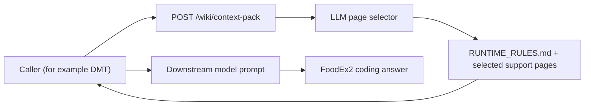
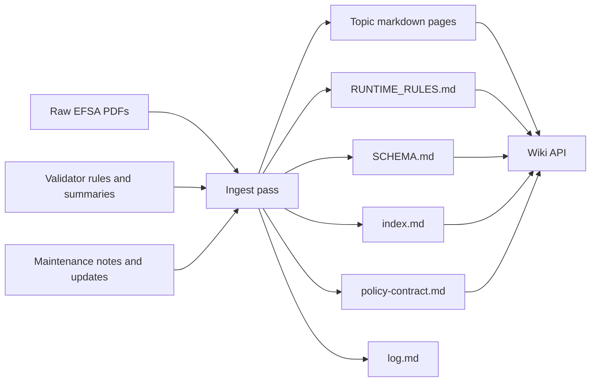

# LLM Knowledge Base

This repository contains a structured markdown knowledge base for EFSA FoodEx2 guidance and FoodEx2 validation policy.

It follows the "LLM wiki" pattern: raw source documents stay immutable, while an LLM incrementally builds and maintains a topic-oriented markdown layer that is easier to read, search, cite, and update over time.

See [PROJECT_CONTEXT.md](/Users/davidfoster/Dev/LLM%20Knowledge%20Base/PROJECT_CONTEXT.md) for the project rationale and the connection to Andrej Karpathy's `llm-wiki` gist.

## Related Projects

- [automatic-couscous](https://github.com/Chili36/automatic-couscous): the FoodEx2 validator project that supplies the operational rule layer reflected in parts of this wiki.
- [Chemmon_Wiki](https://github.com/Chili36/Chemmon_Wiki): the companion wiki focused on Chemical Monitoring guidance and reporting-specific interpretation.
- [DMT](https://github.com/Chili36/DMT): the downstream application that consumes this wiki API for context, policy, and solving workflows.

## Current Status

Yes: the wiki layer has been created.

This project is now at an early alpha stage.

The main thing that is considered stable enough to try is the simple `context-pack` flow:

1. a caller sends a query, optional deconstructed query, and lightweight candidate hints
2. the wiki API uses its internal page selector to choose a small set of relevant pages
3. the API returns those pages as text, with the runtime rules page first
4. the caller packs that text into its own downstream prompt

The current focus is not "wiki-owned solving". The current focus is prompt context delivery.

At the moment, the repository contains:

- Immutable source PDFs in [foodex2_docs](/Users/davidfoster/Dev/LLM%20Knowledge%20Base/foodex2_docs)
- LLM-maintained topic pages in [raw/efsa-guidance](/Users/davidfoster/Dev/LLM%20Knowledge%20Base/raw/efsa-guidance)
- A content index in [index.md](/Users/davidfoster/Dev/LLM%20Knowledge%20Base/index.md)
- A chronological wiki log in [log.md](/Users/davidfoster/Dev/LLM%20Knowledge%20Base/log.md)
- A validator-rule layer distilled from the sibling `Foodex2 Code Validator` project
- A local FastAPI retrieval service in `wiki_api/` so client applications can request selected wiki context from this repo instead of owning wiki navigation themselves

The current wiki pages include:

- [foodex2-overview.md](/Users/davidfoster/Dev/LLM%20Knowledge%20Base/raw/efsa-guidance/foodex2-overview.md)
- [base-term-selection.md](/Users/davidfoster/Dev/LLM%20Knowledge%20Base/raw/efsa-guidance/base-term-selection.md)
- [facet-coding-rules.md](/Users/davidfoster/Dev/LLM%20Knowledge%20Base/raw/efsa-guidance/facet-coding-rules.md)
- [implicit-vs-explicit-facets.md](/Users/davidfoster/Dev/LLM%20Knowledge%20Base/raw/efsa-guidance/implicit-vs-explicit-facets.md)
- [code-string-format.md](/Users/davidfoster/Dev/LLM%20Knowledge%20Base/raw/efsa-guidance/code-string-format.md)
- [process-facets.md](/Users/davidfoster/Dev/LLM%20Knowledge%20Base/raw/efsa-guidance/process-facets.md)
- [ingredient-facets.md](/Users/davidfoster/Dev/LLM%20Knowledge%20Base/raw/efsa-guidance/ingredient-facets.md)
- [packaging-facets.md](/Users/davidfoster/Dev/LLM%20Knowledge%20Base/raw/efsa-guidance/packaging-facets.md)
- [validation-rules.md](/Users/davidfoster/Dev/LLM%20Knowledge%20Base/raw/efsa-guidance/validation-rules.md)
- [structural-validation.md](/Users/davidfoster/Dev/LLM%20Knowledge%20Base/raw/efsa-guidance/structural-validation.md)
- [term-type-facet-constraints.md](/Users/davidfoster/Dev/LLM%20Knowledge%20Base/raw/efsa-guidance/term-type-facet-constraints.md)
- [process-validation-rules.md](/Users/davidfoster/Dev/LLM%20Knowledge%20Base/raw/efsa-guidance/process-validation-rules.md)
- [domain-specific-validation.md](/Users/davidfoster/Dev/LLM%20Knowledge%20Base/raw/efsa-guidance/domain-specific-validation.md)
- [maintenance-history.md](/Users/davidfoster/Dev/LLM%20Knowledge%20Base/raw/efsa-guidance/maintenance-history.md)
- [maintenance-2015.md](/Users/davidfoster/Dev/LLM%20Knowledge%20Base/raw/efsa-guidance/maintenance-2015.md)
- [maintenance-2016-2018.md](/Users/davidfoster/Dev/LLM%20Knowledge%20Base/raw/efsa-guidance/maintenance-2016-2018.md)
- [maintenance-2019.md](/Users/davidfoster/Dev/LLM%20Knowledge%20Base/raw/efsa-guidance/maintenance-2019.md)
- [maintenance-2020.md](/Users/davidfoster/Dev/LLM%20Knowledge%20Base/raw/efsa-guidance/maintenance-2020.md)
- [maintenance-2021.md](/Users/davidfoster/Dev/LLM%20Knowledge%20Base/raw/efsa-guidance/maintenance-2021.md)
- [maintenance-2022.md](/Users/davidfoster/Dev/LLM%20Knowledge%20Base/raw/efsa-guidance/maintenance-2022.md)
- [maintenance-2023.md](/Users/davidfoster/Dev/LLM%20Knowledge%20Base/raw/efsa-guidance/maintenance-2023.md)
- [maintenance-2024.md](/Users/davidfoster/Dev/LLM%20Knowledge%20Base/raw/efsa-guidance/maintenance-2024.md)

Added since initial bootstrap:

- A formal ingest workflow document in [INGEST_WORKFLOW.md](/Users/davidfoster/Dev/LLM%20Knowledge%20Base/INGEST_WORKFLOW.md)
- A schema document in [SCHEMA.md](/Users/davidfoster/Dev/LLM%20Knowledge%20Base/SCHEMA.md)
- A compact runtime rules file in [RUNTIME_RULES.md](/Users/davidfoster/Dev/LLM%20Knowledge%20Base/RUNTIME_RULES.md)

## Alpha Architecture

This repo has four practical layers:

- Source layer: immutable EFSA PDFs and validator-derived rule sources
- Knowledge layer: topic pages under `raw/efsa-guidance/`
- Retrieval layer: the FastAPI wiki service in `wiki_api/`
- Caller layer: an external application such as DMT that requests pages and packs them into a prompt

At the moment, the simplest and most important runtime path is:



The content-building path looks like this:



## Directory Layout

```text
foodex2_docs/
  Raw EFSA PDF sources

raw/efsa-guidance/
  Topic-oriented markdown knowledge pages derived from the PDFs,
  including guidance pages, validator-rule pages, and annual maintenance pages

wiki_api/
  FastAPI service exposing the wiki catalog, raw page reads, and
  adaptive retrieval and solver endpoints for external clients such as DMT
```

## Page Conventions

Each wiki page should:

- Use YAML frontmatter
- List source PDFs
- Include related-page links
- Keep source-page comments such as `<!-- Source: ... -->`
- Stay concise and scannable
- Attribute claims to source pages or sections
- Prefer topic pages over document dumps

## How This Is Intended To Work

1. Add new EFSA or related source files to `foodex2_docs/`.
2. Read those sources and extract durable rules, examples, and terminology.
3. Update or create topic pages under `raw/efsa-guidance/`.
4. Keep the markdown layer as the default working surface for future FoodEx2 coding questions.
5. Use the PDFs and validator sources as the source of truth whenever a claim needs verification.

For the concrete ingest method, use [INGEST_WORKFLOW.md](/Users/davidfoster/Dev/LLM%20Knowledge%20Base/INGEST_WORKFLOW.md).

## Ingest Flow

The ingest process is deliberately simple:

1. keep the raw documents unchanged
2. distill them into topic pages that are easier for humans and models to navigate
3. connect those topic pages into a dense enough graph that a selector can find the right subset
4. expose those pages through a retrieval API without moving the source of truth into service code

In practice, an ingest or update pass should do all of the following:

- preserve the original PDFs and validator-derived sources unchanged
- update or create topic pages in `raw/efsa-guidance/`
- add or maintain frontmatter fields such as `title`, `sources`, `related`, and `last_updated`
- add inline cross-links so related concepts can be discovered by humans and selectors
- add a `Relevant Business Rules` section when `BRxx` rules materially constrain that page
- add a `Relevant Policy` section when decision order matters for that page
- update [index.md](/Users/davidfoster/Dev/LLM%20Knowledge%20Base/index.md) so the selector sees accurate summaries and keywords
- record the change in [log.md](/Users/davidfoster/Dev/LLM%20Knowledge%20Base/log.md) when the update is material

The practical goal is not to mirror the PDFs page-by-page. The goal is to produce a usable markdown layer that lets a caller retrieve the right guidance pages for a concrete coding case.

## Knowledge Base Shape

The knowledge base is intentionally not flat even though it is stored as markdown files.

It has a few recurring page types:

- orientation and schema pages such as [SCHEMA.md](/Users/davidfoster/Dev/LLM%20Knowledge%20Base/SCHEMA.md)
- compact runtime pages such as [RUNTIME_RULES.md](/Users/davidfoster/Dev/LLM%20Knowledge%20Base/RUNTIME_RULES.md)
- orientation pages such as [foodex2-overview.md](/Users/davidfoster/Dev/LLM%20Knowledge%20Base/raw/efsa-guidance/foodex2-overview.md)
- operational guidance pages such as [base-term-selection.md](/Users/davidfoster/Dev/LLM%20Knowledge%20Base/raw/efsa-guidance/base-term-selection.md) and [implicit-vs-explicit-facets.md](/Users/davidfoster/Dev/LLM%20Knowledge%20Base/raw/efsa-guidance/implicit-vs-explicit-facets.md)
- validator-facing rule pages such as [business-rules.md](/Users/davidfoster/Dev/LLM%20Knowledge%20Base/raw/efsa-guidance/business-rules.md) and [process-validation-rules.md](/Users/davidfoster/Dev/LLM%20Knowledge%20Base/raw/efsa-guidance/process-validation-rules.md)
- domain overlays such as [domain-specific-validation.md](/Users/davidfoster/Dev/LLM%20Knowledge%20Base/raw/efsa-guidance/domain-specific-validation.md)
- maintenance pages that explain yearly changes
- one richer control-layer page: [policy-contract.md](/Users/davidfoster/Dev/LLM%20Knowledge%20Base/raw/efsa-guidance/policy-contract.md)

The runtime rules page and the policy page are both still markdown in the repo. They are not secret service-side prompts. The API reads them from the repo and exposes them as normal wiki content.

The repo also has a lightweight relationship model rather than a flat pile of pages: frontmatter `related` links, inline `[[...]]` cross-links, `Relevant Policy` sections, `Relevant Business Rules` sections, and `index.md` as the main hub. The details are documented in [SCHEMA.md](/Users/davidfoster/Dev/LLM%20Knowledge%20Base/SCHEMA.md).

## What Context-Pack Does

`POST /wiki/context-pack` is the alpha endpoint to understand first.

Its purpose is narrow:

- take a coding case
- choose a small set of wiki pages with the internal page selector
- return those pages so the caller can pack them into its own prompt

The intended caller pattern is:

1. search externally and build a candidate list
2. call `/wiki/context-pack`
3. receive the selected wiki pages
4. place those pages into a downstream prompt
5. let the downstream model do the final coding

That means this repo currently behaves more like a context service than a full autonomous coding service.

## What We Always Attach

For the simple `context-pack` path, the API always attaches the compact runtime layer before the ordinary guidance pages.

In practice, the caller receives:

- `guiding_principles` derived from [index.md](/Users/davidfoster/Dev/LLM%20Knowledge%20Base/index.md)
- `policy_contract` parsed from [policy-contract.md](/Users/davidfoster/Dev/LLM%20Knowledge%20Base/raw/efsa-guidance/policy-contract.md)
- `pages_used`
- `pages`, with [RUNTIME_RULES.md](/Users/davidfoster/Dev/LLM%20Knowledge%20Base/RUNTIME_RULES.md) forced to the top
- `trace` metadata

The important design decision is that the runtime and policy layers are still markdown-backed. The JSON `policy_contract` field is a convenience view for callers that want structure, but the canonical source of truth remains the markdown pages themselves.

Business rules are not blindly attached on every request. Instead, the knowledge pages are expected to backlink the `BRxx` rules that materially constrain them, and the selector should return the right support pages for the case at hand.

## Wiki API

This repo now owns the wiki retrieval surface. Client applications should call this service instead of re-implementing wiki selection logic elsewhere.

Create and use the repo-local environment:

```bash
python3 -m venv .venv
. .venv/bin/activate
pip install -r requirements.txt
```

Then edit [`.env.example`](/Users/davidfoster/Dev/LLM%20Knowledge%20Base/.env.example) into a local `.env`, or edit the generated [`.env`](/Users/davidfoster/Dev/LLM%20Knowledge%20Base/.env) directly:

```bash
cp .env.example .env
```

Set at least:

```bash
ANTHROPIC_API_KEY=...
WIKI_LIBRARIAN_MODEL=claude-3-7-sonnet-latest
```

Optional overrides:

```bash
WIKI_CONTEXT_MODEL=claude-3-7-sonnet-latest
WIKI_POLICY_MODEL=claude-3-7-sonnet-latest
WIKI_SOLVER_MODEL=claude-3-7-sonnet-latest
```

If the endpoint-specific variables are unset, the service falls back to `WIKI_LIBRARIAN_MODEL`.

Run it locally with:

```bash
. .venv/bin/activate
uvicorn wiki_api.app:app --reload
```

`context-pack`, `policy-pack`, and `solve` currently use Anthropic internally. `context-pack` uses the lighter page-selector path, while `policy-pack` and `solve` use the richer librarian and solver flow. The wiki API loads `ANTHROPIC_API_KEY`, `WIKI_LIBRARIAN_MODEL`, and the optional endpoint-specific overrides from `.env`.
For the LLM-driven paths, the service injects `index.md` into the first prompt so the model can choose and batch follow-up wiki page reads without spending a separate LLM turn just to fetch the catalog.

For alpha usage, start with `context-pack`.

Main endpoints:

- `GET /health`: service health check
- `GET /wiki/index`: raw `index.md`
- `GET /wiki/pages`: page catalog with titles and summaries
- `GET /wiki/pages/{page_name}`: one wiki page
- `GET /wiki/graph`: generated adjacency map built from markdown links and frontmatter
- `GET /wiki/pages/{page_name}/backlinks`: generated incoming-link view for one page
- `POST /wiki/context-pack`: the main alpha endpoint; returns selected wiki pages plus trace metadata so a caller can build its own prompt
- `POST /wiki/policy-pack`: runs the internal wiki librarian, returns selected pages plus a synthesized policy pack for a coding case
- `POST /wiki/solve`: runs the internal wiki librarian and a final coding solver, then returns a complete FoodEx2 coding result plus the underlying context and trace

Endpoint-specific request guidance:

- `POST /wiki/context-pack`: prefer `candidate_hints` with only `code`, `name`, and `termType`
- `POST /wiki/policy-pack`: prefer `candidates_trimmed` with `code`, `name`, `termType`, optional `coverageText`, and optional `implicitFacets`
- `POST /wiki/solve`: send the full `candidates` list because this endpoint makes the final coding decision

Legacy compatibility:

- `context-pack` and `policy-pack` still accept a full `candidates` list, but the service reduces that payload internally before selection or LLM retrieval
- the canonical machine-readable contract is published at `GET /openapi.json`

Example `POST /wiki/context-pack` body:

```json
{
  "search_term": "Tomato basil and garlic sauce in a glass jar",
  "deconstructed_query": {
    "raw_query": "Tomato basil and garlic sauce in a glass jar",
    "base_term": "tomato basil and garlic sauce",
    "components": [
      {"text": "sauce", "kind": "PROCESS"},
      {"text": "glass jar", "kind": "PACKAGING"}
    ]
  },
  "candidate_hints": [
    {"code": "A044C", "name": "Tomato-containing cooked sauces", "termType": "s"},
    {"code": "A07NN", "name": "Jar", "termType": "f"},
    {"code": "A07PF", "name": "Glass", "termType": "f"}
  ],
  "context": {},
  "max_pages": 7,
  "include_page_content": true
}
```

Example `POST /wiki/policy-pack` body:

```json
{
  "search_term": "Tomato basil and garlic sauce in a glass jar",
  "deconstructed_query": {
    "raw_query": "Tomato basil and garlic sauce in a glass jar",
    "base_term": "tomato basil and garlic sauce",
    "components": [
      {"text": "sauce", "kind": "PROCESS"},
      {"text": "glass jar", "kind": "PACKAGING"}
    ]
  },
  "candidates_trimmed": [
    {
      "code": "A044C",
      "name": "Tomato-containing cooked sauces",
      "termType": "s",
      "coverageText": "...",
      "implicitFacets": [
        {"facetType": "F04", "facetCode": "A0DMX", "facetMeaning": "Tomatoes"}
      ]
    },
    {"code": "A07NN", "name": "Jar", "termType": "f"},
    {"code": "A07PF", "name": "Glass", "termType": "f"}
  ],
  "context": {},
  "max_pages": 6,
  "include_page_content": true
}
```

`POST /wiki/policy-pack` response includes:

- `guiding_principles`: the high-level FoodEx2 worldview from `index.md`
- `policy_contract`: the small always-on control layer with constitution, decision procedure, binding rules, tie-break rules, and anti-patterns
- `pages_used`: selected wiki pages
- `pages`: selected page metadata plus optional markdown content
- `query_classification`: inferred food type, domain, and signals
- `candidate_focus`: promising codes and rejected patterns
- `policy_pack`: compact rules grouped into base-term, facet, validation, domain, and construction buckets
- `trace`: retrieval metadata including the internal page-read trace, token summary, and timing summary

`POST /wiki/context-pack` response includes:

- `guiding_principles`: the high-level FoodEx2 worldview from `index.md`
- `policy_contract`: the small always-on control layer with constitution, decision procedure, binding rules, tie-break rules, and anti-patterns
- `pages_used`: selected wiki pages
- `pages`: selected page metadata plus optional markdown content, with `RUNTIME_RULES.md` returned first
- `trace`: retrieval metadata including page-selection trace, token summary, and timing summary

`POST /wiki/solve` response includes:

- `guiding_principles`: the high-level FoodEx2 worldview from `index.md`
- `policy_contract`: the small always-on control layer the solver must obey before consulting examples or local specificity
- `pages_used`: selected wiki pages
- `pages`: selected page metadata plus optional markdown content
- `query_classification`: inferred case framing from the retrieval stage
- `candidate_focus`: the retrieval stage's candidate preferences and rejected patterns
- `policy_pack`: the synthesized wiki-derived rule pack used by the solver
- `solution`: final FoodEx2 coding result including selected base term, constructed code, validation check, alternatives, and confidence
- `trace`: split process metadata for retrieval, solver, and totals including models, tokens, calls, and timing

Use `context-pack` when you want pure context delivery plus the compact runtime rules layer, and will do the main reasoning in a downstream model. This is the primary alpha path.
Use `policy-pack` when you want the wiki service to act as a solver-style knowledge synthesizer.
Use `solve` when you want the wiki service to return the final FoodEx2 coding decision itself, still grounded in the selected wiki context and external candidate list.

The current runtime layer is [RUNTIME_RULES.md](/Users/davidfoster/Dev/LLM%20Knowledge%20Base/RUNTIME_RULES.md), and the richer control layer is [policy-contract.md](/Users/davidfoster/Dev/LLM%20Knowledge%20Base/raw/efsa-guidance/policy-contract.md). Both are markdown-backed and retrieval-visible; the API reads and exposes them, but does not author them in service code.

The graph and backlink endpoints are also derived artifacts. They are generated from the same markdown relationship model rather than maintained as separate handwritten pages.

Run tests with:

```bash
. .venv/bin/activate
pytest -q
```

## Scope Notes

- The discontinued Smart Coding App is intentionally not included in this wiki.
- The current emphasis is FoodEx2 coding guidance plus validation logic, not full EFSA data-submission workflow coverage.
