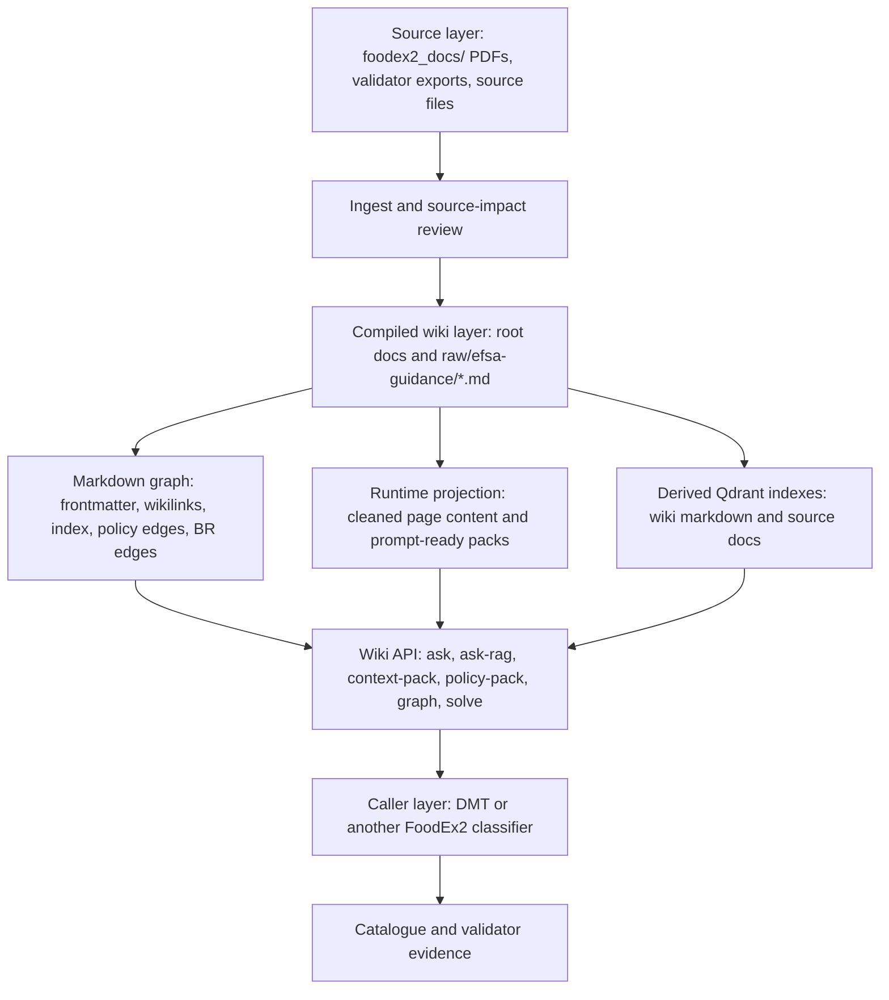
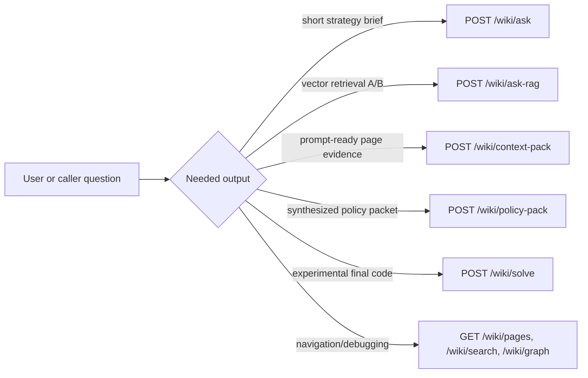
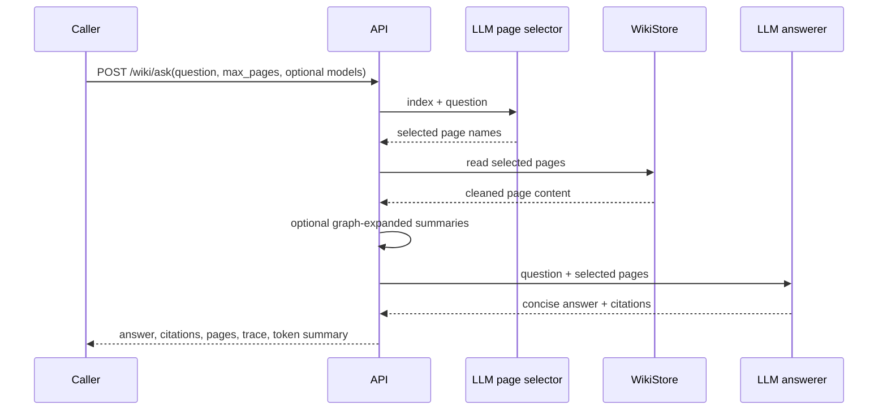
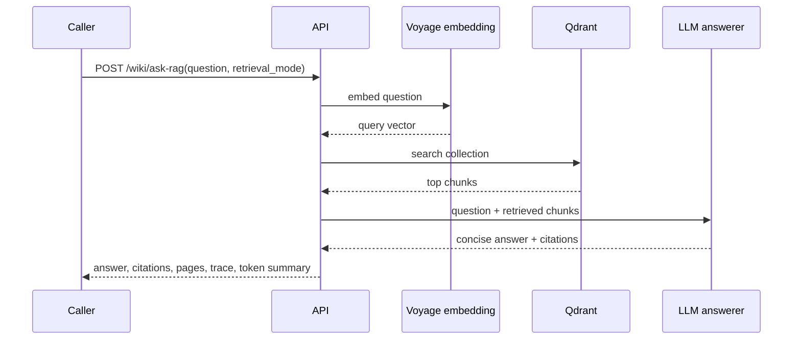

# Wiki Architecture For Models

This page is written for another model, agent, or maintainer that needs to understand what this FoodEx2 wiki is, how it is structured, and how to use or modify it without accidentally changing the system's meaning.

It is not a FoodEx2 coding guide. It is an orientation map for the architecture around the coding guides.

## One-Sentence Summary

This repository is a maintained LLM wiki for FoodEx2: immutable source documents are distilled into interlinked markdown pages, the markdown remains the source of operational guidance, and a local API exposes guidance briefs, page-evidence packs, graph views, and derived RAG experiments to downstream tools such as DMT.

## Core Thesis

The wiki is built around one architectural decision:

Do the expensive interpretation work once, preserve the result as readable markdown, and let future model calls retrieve from that maintained knowledge layer instead of re-reading source PDFs or relying on hidden prompt text.

This has several consequences:

- The raw sources stay immutable in `foodex2_docs/`.
- The durable knowledge lives in markdown pages.
- The wiki is topic-oriented, not document-order-oriented.
- Runtime prompts should read wiki pages, not private service constants.
- Qdrant collections are derived retrieval artifacts, not canonical knowledge.
- The deterministic doctor checks mechanical health before LLM lint reviews semantic drift.
- Domain overlays are opt-in and must not leak into ordinary all-domain coding unless context activates them.

## What This Wiki Is

The wiki is a compiled knowledge layer for FoodEx2 guidance and validation policy.

It covers:

- FoodEx2 coding philosophy.
- Base-term selection.
- Facet construction.
- Implicit versus explicit facets.
- FoodEx2 code-string syntax.
- Process, ingredient, and packaging facets.
- Business-rule and validator behavior.
- Domain overlays for chemical monitoring, pesticides, contaminants, VMPR/VETDRUG, additives, and flavourings.
- Annual FoodEx2 maintenance changes.
- Expert-guidance sources such as the ANSES codification guidance.
- Local architecture, ingest, schema, and maintenance conventions.

The wiki exists because FoodEx2 decisions often require combining guidance from several places. A single coding case may need base-term rules, term-type constraints, implicit facet rules, process validation, and a domain overlay. The markdown layer makes those relationships explicit and reusable.

## What This Wiki Is Not

The wiki is not the FoodEx2 catalogue.

It should not be used as the authority for whether a term exists, what all descendants are, or whether a candidate list is complete. Catalogue and validator systems still own that operational data.

The wiki is not a replacement validator.

It documents validator behavior, known divergences, and business-rule policy, but the final code still needs validation by the FoodEx2 validator when a caller is constructing reportable codes.

The wiki is not an autonomous solver by default.

`/wiki/solve` exists for experiments, but the production stance is usually that DMT or another downstream classifier builds and validates the final FoodEx2 code using wiki guidance, candidate data, and validator output.

The wiki is not a raw RAG dump.

The main knowledge layer is curated markdown. Qdrant retrieval exists for A/B tests, source audits, and cases where vector recall may beat page selection, but it does not replace the wiki pages.

## Layer Model

The project has several layers. A model should keep them separate.



### 1. Source Layer

Location:

- `foodex2_docs/`
- selected source-oriented artifacts such as validator-derived summaries

Purpose:

- preserve original EFSA PDFs, maintenance reports, reporting guidance, and expert guidance
- provide source verification when a wiki claim is questioned
- support future ingest passes

Rules:

- Do not overwrite raw sources with generated interpretation.
- Do not treat source PDFs as prompt-ready runtime context by default.
- Do not import every sentence from a source into the wiki.
- Use source impact reports when a new source may materially change guidance.

### 2. Source-Intake Layer

Location:

- `reports/source-intake/`
- `wiki_api/source_intake.py`

Purpose:

- answer "what will this source add?" before editing operational pages
- distinguish source tier and authority
- identify overlap, conflicts, risk, affected pages, and candidate test cases

The source-intake report is a maintainer aid. It is not a rule page and should not be treated as runtime guidance unless its findings are later incorporated into the curated wiki.

### 3. Compiled Wiki Layer

Locations:

- root orientation/runtime docs such as `README.md`, `PROJECT_CONTEXT.md`, `KNOWLEDGE_ARCHITECTURE.md`, `SCHEMA.md`, `INGEST_WORKFLOW.md`, `MAINTENANCE_WORKFLOW.md`, and `RUNTIME_RULES.md`
- topic pages under `raw/efsa-guidance/`
- navigation pages such as `index.md` and `log.md`

Purpose:

- store durable FoodEx2 guidance in small topic pages
- make rules, exceptions, examples, and domain overlays readable to humans and models
- keep source-backed policy in markdown rather than service code

This is the canonical operational knowledge layer.

### 4. Markdown Graph Layer

The wiki uses markdown-native graph structure rather than a separate graph database.

Edges come from:

- frontmatter `related`
- inline `[[wikilinks]]`
- `Relevant Policy` sections
- `Relevant Business Rules` sections
- `index.md` summaries
- generated backlinks and graph views from the API

This graph is deliberately lightweight. It gives page selectors, humans, and tools enough structure to navigate without adding a separate authoring format.

### 5. Runtime API Layer

Location:

- `wiki_api/`

Purpose:

- serve pages
- select relevant guidance
- synthesize concise wiki-grounded answers
- return prompt-ready context packs
- expose graph and backlink data
- expose Qdrant-backed retrieval experiments
- report wiki and RAG health

Important principle:

The service should read rules from markdown pages. It should not become a hidden second wiki.

### 6. Derived Vector Layer

Locations:

- `scripts/index_wiki_qdrant.py`
- `scripts/index_source_qdrant.py`
- `wiki_api/rag_index.py`
- `wiki_api/qdrant_ask.py`
- `reports/wiki-rag-manifest.json`

Default collections:

- `foodex2_wiki_markdown_v1`: chunks derived from curated markdown pages
- `foodex2_source_docs_v1`: chunks derived from raw source documents

Purpose:

- compare page-selector retrieval with vector retrieval
- test whether curated markdown or source-document RAG answers better for a given case
- support source-audit experiments

Rules:

- Rebuild Qdrant from markdown or source files.
- Do not edit Qdrant as if it were source.
- Use `GET /wiki/rag/status` or `python scripts/wiki_rag_status.py` to detect drift.
- Treat missing, stale, orphaned, or embedding-mismatched chunks as derived-index maintenance problems, not wiki truth problems.

### 7. Maintenance Layer

Locations:

- `wiki_api/doctor.py`
- `wiki_api/llm_lint.py`
- `MAINTENANCE_WORKFLOW.md`
- tests under `tests/`

Purpose:

- keep served pages registered and indexed
- detect broken links, unresolved wikilinks, missing page categories, graph orphans, and prompt-projection problems
- detect Qdrant drift when enabled
- allow supervised semantic review with LLM lint

The deterministic doctor is the first gate. LLM lint is a review aid, not an autonomous editor.

### 8. Caller Layer

Examples:

- DMT
- a document-chat or classifier pipeline
- a local experiment harness

Responsibilities:

- supply the food/feed term or reporting question
- supply domain context when known
- supply candidate terms, catalogue evidence, and validator output when building a code
- decide which wiki surface is appropriate
- construct and validate the final code unless explicitly using `/wiki/solve`

The caller should not have to know the wiki's page graph. It should ask the wiki for guidance or context and then combine that with catalogue and validator evidence.

## Repository Map

| Path | Role |
| --- | --- |
| `README.md` | Repo overview, status, related projects, and runtime surfaces. |
| `PROJECT_CONTEXT.md` | Why the wiki exists and how it follows the LLM-wiki operating model. |
| `KNOWLEDGE_ARCHITECTURE.md` | Architecture stance on compiled markdown, graph retrieval, Qdrant, and long-source ingest. |
| `WIKI_ARCHITECTURE_FOR_MODELS.md` | This model-facing architecture orientation. |
| `SCHEMA.md` | Page types, frontmatter fields, source tiers, section conventions, and serving rules. |
| `INGEST_WORKFLOW.md` | Practical workflow for source intake and topic-page updates. |
| `MAINTENANCE_WORKFLOW.md` | Deterministic doctor, Qdrant drift checks, LLM lint, and maintainer loop. |
| `RUNTIME_RULES.md` | Compact prompt-facing FoodEx2 coding rules for page-evidence contexts. |
| `index.md` | Human and selector-visible content catalog. |
| `log.md` | Chronological record of material wiki changes. |
| `foodex2_docs/` | Immutable source documents. |
| `raw/efsa-guidance/` | Curated topic pages used by humans, page selectors, and API responses. |
| `wiki_api/` | FastAPI service, page store, LLM librarian, Qdrant ask path, doctor, and lint tools. |
| `scripts/` | Operational scripts for model sweeps, Qdrant indexing, retrieval comparisons, and RAG status. |
| `tests/` | API, librarian, doctor, and lint tests. |
| `reports/` | Source-intake, retrieval A/B, and other diagnostic reports. |

## Page Types

The wiki uses page categories to decide how pages are served and whether they can appear in prompt-facing contexts.

### Orientation Pages

Examples:

- `README.md`
- `PROJECT_CONTEXT.md`
- `KNOWLEDGE_ARCHITECTURE.md`
- `WIKI_ARCHITECTURE_FOR_MODELS.md`
- `INGEST_WORKFLOW.md`
- `MAINTENANCE_WORKFLOW.md`
- `SCHEMA.md`
- `index.md`

Use:

- explain the repo
- explain architecture
- define page schema
- define ingest and maintenance workflows

Orientation pages are for humans and maintainers. They should not normally be attached as coding prompt context.

### Runtime Pages

Examples:

- `RUNTIME_RULES.md`
- `policy-contract.md`

Use:

- define prompt-facing decision order
- state always-on coding rules
- expose policy that must stay visible to downstream prompts

Runtime pages are intentionally compact and model-facing.

### Guidance Pages

Examples:

- `foodex2-overview.md`
- `base-term-selection.md`
- `facet-coding-rules.md`
- `implicit-vs-explicit-facets.md`
- `process-facets.md`
- `ingredient-facets.md`
- `packaging-facets.md`
- `anses-codification-guidance.md`

Use:

- explain FoodEx2 concepts
- preserve operational coding conventions
- connect examples to reusable rules

### Validation Pages

Examples:

- `business-rules.md`
- `validation-rules.md`
- `structural-validation.md`
- `term-type-facet-constraints.md`
- `process-validation-rules.md`

Use:

- explain validator behavior
- document business rules and known divergences
- describe facet legality and code-structure constraints

### Domain Overlay Pages

Examples:

- `chemical-monitoring-foodex2.md`
- `pesticides-foodex2.md`
- `contaminants-foodex2.md`
- `vmpr-foodex2.md`
- `vmpr-legislative-mapping.md`
- `additives-flavourings-foodex2.md`
- `domain-specific-validation.md`

Use:

- capture reporting-domain behavior
- add domain-specific explicit-facet requirements
- document legislative mapping or monitoring-specific exceptions

Domain overlays are conditional. Do not apply them unless the request, caller context, candidate collection, or explicit domain flag activates them.

### Maintenance Pages

Examples:

- `maintenance-history.md`
- `maintenance-2015.md` through `maintenance-2024.md`
- `log.md`

Use:

- record annual changes
- document release deltas and maintenance impacts
- preserve a history of wiki changes

Maintenance pages help source audit and broad explanation. They should not be automatically attached to every coding prompt.

## Source Tiers

The wiki can tag pages or source-derived claims by authority when the distinction matters.

Allowed values:

- `authoritative_rule`: EFSA catalogue, EFSA business rules, official validator behavior, ChemMon reporting guidance, legislation, or other sources that define obligations.
- `expert_guidance`: official institutional or expert FoodEx2 guidance, training, coding guides, examples, or conventions that explain practice but should not override authoritative rules.
- `local_policy`: project-specific reference decisions, scoring conventions, or grey-area choices.
- `diagnostic`: model logs, retrieval comparisons, failure analyses, and tool observations.

The point of source tiers is not bureaucracy. The point is to avoid silently turning an example, local scoring decision, or diagnostic observation into a general FoodEx2 rule.

## Runtime Surfaces

The wiki API exposes several surfaces. They are intentionally different.



### `GET /wiki/view`

Human-readable wiki viewer.

Use this for browsing pages locally in the browser.

### `GET /wiki/graph-view`

Human-readable graph browser.

Use this to inspect page relationships, backlinks, and graph shape.

### `GET /wiki/index`

Returns the wiki catalog.

The LLM page selector receives this catalog so it can pick relevant pages without needing to know filenames from memory.

### `GET /wiki/pages`

Lists served pages with metadata.

Useful for debugging registration and categories.

### `GET /wiki/pages/{page_name}`

Returns one page.

The page can be a root doc, `index.md`, `log.md`, or a markdown page under `raw/efsa-guidance/`.

### `GET /wiki/search`

Performs basic text search over served wiki pages.

This is useful for humans and diagnostics. It is not the same as Qdrant semantic retrieval.

### `POST /wiki/ask`

Compact guidance endpoint.

Use this when the caller wants a short wiki-grounded answer, usually phrased as:

- "What should I think about when coding this?"
- "Which rules matter here?"
- "Is this likely a derivative or composite?"
- "Does a domain overlay matter?"
- "Which facet families might be relevant?"

Flow:



Important behavior:

- It uses a service-owned LLM page selector.
- It can add summary-only graph expansion around selected pages.
- It runs a second answerer call grounded in selected pages.
- It returns citations and trace metadata.
- It supports per-request selector and answerer model overrides.
- It is not a catalogue lookup.
- It is not a validator.
- It is not supposed to invent missing FoodEx2 codes.

### `POST /wiki/ask-rag`

Compact guidance endpoint backed by Qdrant retrieval.

Use this for A/B tests and retrieval experiments where the caller wants the same answer shape as `/wiki/ask`, but with semantic retrieval instead of the page-selector path.

Modes:

- `retrieval_mode: "wiki"` searches the curated markdown collection.
- `retrieval_mode: "source"` searches the raw source-document collection.

Flow:



Important behavior:

- The answerer is the same conceptual role as `/wiki/ask`.
- The retrieval source differs.
- The result is useful for comparing page selection against vector recall.
- Raw source RAG should feed wiki updates when it reveals missing durable guidance.
- It should not become a shadow source of truth.

### `POST /wiki/context-pack`

Prompt-ready page-evidence endpoint.

Use this when a downstream classifier wants selected wiki pages to place into its own prompt.

Flow:

1. The caller sends the source term, optional deconstructed query, optional minimal candidate hints, and optional context.
2. The page selector reads `index.md` and chooses relevant pages.
3. The API always places `RUNTIME_RULES.md` at the front.
4. The API projects page content for classification prompts, omitting navigation and bulky sections.
5. The downstream model receives the page evidence and makes the coding decision with candidate and validator data.

This is the main "wiki supplies context, caller solves" surface.

### `POST /wiki/policy-pack`

Synthesized policy-packet endpoint.

Use this when the caller wants a structured interpretation of selected pages without asking the wiki to output a final code.

It returns:

- guiding principles
- policy contract
- pages used
- query classification
- candidate focus
- base-term, facet, validation, domain, construction, and gap notes

This endpoint is heavier than `/wiki/context-pack` because it asks the librarian to synthesize a policy packet.

### `POST /wiki/solve`

Experimental wiki-owned solver.

Use only when the experiment explicitly wants the wiki service to select a candidate and construct the final code.

Production caveat:

Downstream systems normally should not outsource final FoodEx2 coding to the wiki. The caller usually has better access to the candidate universe, catalogue data, validator output, dataset-specific context, and evaluation harness.

### `GET /wiki/rag/status`

Deterministic Qdrant wiki-index health endpoint.

It compares expected markdown-derived chunks against the live Qdrant collection and reports:

- missing pages
- stale pages
- orphaned pages
- missing chunks
- stale chunks
- orphaned chunks
- embedding model mismatches
- embedding dimension mismatches
- malformed payloads

This is deterministic drift detection, not LLM judgement.

### `GET /wiki/graph` And `GET /wiki/graph/compact`

Graph endpoints derived from markdown links and frontmatter.

Use these to inspect whether pages are connected, identify hubs, and find orphans.

## Model Routing

The wiki supports several model providers for LLM-owned steps.

The current routing behavior is implemented in `wiki_api/librarian.py`.

Provider selection is model-name based unless the environment forces local routing:

- `claude*` or unknown model names route to Anthropic.
- `gpt*`, `o1*`, `o3*`, `o4*`, or `o5*` route to OpenAI-compatible hosted calls.
- `gemini*` routes to Gemini.
- `lmstudio:<model>`, `lm-studio:<model>`, `lmstudio/<model>`, or `lm-studio/<model>` route to LM Studio.
- `WIKI_LLM_PROVIDER=lmstudio`, `lm-studio`, or `local` forces local LM Studio routing.

Environment variables define defaults for each role, including the librarian, context selector, answerer, lint, intake, and solver roles.

`/wiki/ask` also accepts per-request selector and answerer overrides:

- `selector_model`
- `answerer_model`
- `selector_reasoning_effort`
- `answerer_reasoning_effort`

Reasoning-effort fields are passed only to providers that support the OpenAI-compatible `reasoning_effort` parameter. Providers that do not support it ignore it.

Important model-use principle:

Use strong enough models for semantic source intake, lint, and difficult page selection, but do not assume every runtime guidance question needs heavy reasoning. The API exposes model choice so DMT and other callers can measure accuracy, latency, and cost rather than hard-coding a single answer.

## How Page Selection Works

The page selector is not vector search.

It receives:

- the full `index.md` catalog
- the user query or search term
- optional deconstructed query fields
- optional candidate hints
- optional context

It returns a small list of page names.

The selector is instructed to:

- choose only pages needed for the current case
- prefer pages that resolve food type, process, facet legality, domain rules, ingredients, or packaging
- avoid solving the FoodEx2 task
- avoid summarizing or rewriting the wiki
- keep within the page limit

This means `index.md` summaries are operational. If a page summary hides a key concept, the selector may miss the page.

## How Prompt Projection Works

Not every served page is suitable for a model classification prompt.

The store has prompt-facing categories:

- `runtime`
- `guidance`
- `validation`
- `domain_overlay`

Orientation and maintenance pages are served to humans and APIs, but they are not normally projected into context-pack prompts.

When a page is projected for `context-pack`, sections such as appendices, authority notes, ingest instructions, related links, relevant policy, relevant business rules, and worked examples can be omitted to keep prompts focused.

The point is to give a classifier the operational rules it needs without dumping every page scaffold into the prompt.

## How The Wiki Thinks About FoodEx2

The wiki's core coding model is:

1. Determine the food type first: raw commodity, derivative, or composite.
2. Choose the best reportable non-hierarchy base term within that food type.
3. If FoodEx2 already has a derivative or composite base that captures the processed state, use it instead of reconstructing from a raw base plus explicit facets.
4. Add only explicit facets that contribute information not already implicit in the chosen base term.
5. Validate the construction against facet legality, process rules, hierarchy/reportability limits, and code syntax.

This is why the wiki has separate pages for:

- base-term selection
- facet coding
- implicit versus explicit facets
- process facets
- ingredient facets
- term-type and facet constraints
- process validation
- domain-specific validation

The wiki should not encourage bottom-up construction from attractive descriptors when FoodEx2 already has a standard base term.

At the same time, a valid base term alone is not automatically complete. Meaningful source facts must be accounted for as implicit in the base, explicitly faceted, unsupported, not codeable, or domain-inactive.

## Domain Overlay Philosophy

The all-domain default matters.

The wiki should not infer pesticides, contaminants, VMPR, microbiology, additives, or flavourings just because a term could occur in those domains.

A domain overlay becomes active when:

- the caller supplies an explicit domain
- the reporting context identifies the domain
- candidate collections or monitoring flags clearly identify the domain
- legal references or parameter hierarchies identify the domain

When a domain is active, the wiki may return the relevant domain overlay page and domain-specific validation page.

When no domain is active, the ordinary FoodEx2 workflow remains the default.

This distinction is especially important for cases such as VMPR biological samples, contaminant-specific F33 behavior, pesticide Annex/MRL routing, additives/flavourings legislative classes, and microbiology-specific facets.

## Ingest Philosophy

Ingest is not "summarize the PDF."

Ingest is:

1. identify source identity, authority, scope, and intended audience
2. scan structure
3. write a source impact report when material
4. decide which topic pages are affected
5. extract durable rules, examples, definitions, and exceptions
6. patch existing pages where possible
7. create new pages only when the concept has stable scope
8. update `index.md`, `log.md`, and links
9. run the doctor and tests

The source impact report is important because it asks the pre-edit question: what will this source add, and what authority does it have?

This prevents two common failures:

- importing an expert example as if it were an authoritative rule
- creating a giant document dump that is hard to retrieve and maintain

## Maintenance Philosophy

Maintenance has two levels.

First, deterministic checks:

- served page missing from `index.md`
- index link that does not resolve
- missing page-category registration
- unresolved wikilink
- local markdown link broken
- prompt-facing page projecting to empty context
- non-prompt page unexpectedly projecting into prompt content
- graph orphan
- RAG index drift when the Qdrant check is enabled

Second, supervised LLM review:

- contradictions between pages
- stale index summaries
- missing domain routing signals
- page scope problems
- missing source traceability
- overfit examples
- rule language that should be downgraded to example language

The LLM can help find semantic problems, but it should not silently rewrite or merge the wiki.

## Architecture Rules For Future Changes

Follow these rules when editing this repo.

### Keep Rule Knowledge In Markdown

If a coding policy can be stated in markdown, put it in markdown.

Service code may select, project, and serve pages, but it should not become the only place where a FoodEx2 rule exists.

### Do Not Overfit

Do not add a wiki rule just because one model failed one example.

Before adding a rule, ask:

- Is this source-backed?
- Is it generalizable beyond the case?
- Does it belong to an existing page?
- Is it a rule, an example, a local scoring decision, or a grey-area note?
- Could it harm another valid interpretation?

### Keep Domain Context Explicit

Do not make a reporting-domain overlay global unless the source says it is global.

If the caller knows the domain, the caller should pass it. The wiki should determine what that domain means.

### Keep Qdrant Derived

If Qdrant disagrees with markdown, fix the index or update the markdown with source-backed changes. Do not treat the vector collection as the canonical page.

### Keep Generated Reports Out Of Runtime Guidance

Reports under `reports/` can be useful, but they are diagnostics or source-intake artifacts. They become runtime guidance only when their findings are deliberately incorporated into curated pages.

### Prefer Small Topic Pages

Create pages around durable concepts, not around one example.

Good page candidates:

- a recurring facet family
- a reporting-domain overlay
- a validation-rule family
- a maintenance release with current impact
- an official expert-guidance source with reusable conventions

Bad page candidates:

- one failed model output
- one isolated prompt hack
- a long source dump
- a page that repeats content already covered elsewhere

## Common Anti-Patterns

Avoid these mistakes:

- Treating `foodex2_docs/` PDFs as mutable wiki pages.
- Moving source-backed rules into hidden service prompts.
- Adding deterministic code patches for one observed FoodEx2 example.
- Letting domain overlays apply without explicit domain context.
- Using `/wiki/ask-rag` as proof that markdown is wrong.
- Creating a Qdrant collection and forgetting to monitor drift.
- Updating `raw/efsa-guidance/` without updating `index.md`.
- Adding a served root page without registering it in `WikiStore`.
- Adding a page without source traceability.
- Treating validation acceptance as semantic correctness.
- Treating a human reference code as automatically correct.
- Treating a model failure report as an authoritative source.
- Dumping long PDF content into one enormous markdown file.

## How Another Model Should Use This Wiki

If you are a model asked to use this repo:

1. Read this page for architecture.
2. Read `index.md` to find the page family.
3. Read `RUNTIME_RULES.md` for compact FoodEx2 coding order.
4. Read the relevant guidance, validation, and domain pages.
5. Use catalogue and validator evidence for actual terms and final validation.
6. Treat Qdrant results as retrieval evidence only.
7. State uncertainty when the wiki lacks the required source or code.
8. Avoid writing new rules unless the source and scope justify them.

If you are asked to add source material:

1. Preserve the raw source.
2. Run or write a source impact report.
3. Patch durable topic pages.
4. Update links, index, and log.
5. Run the doctor and tests.
6. Rebuild derived RAG collections if markdown pages changed and Qdrant is used.

If you are asked to debug retrieval:

1. Check `index.md` summaries.
2. Check page registration and category in `WikiStore`.
3. Check graph links and backlinks.
4. Check whether the relevant page is prompt-facing or orientation-only.
5. Compare `/wiki/ask`, `/wiki/context-pack`, `/wiki/ask-rag` wiki mode, and `/wiki/ask-rag` source mode when needed.
6. Check `GET /wiki/rag/status` before trusting Qdrant behavior.

## Local Commands

Run the deterministic doctor:

```bash
python -m wiki_api.doctor
```

Run the doctor with Qdrant drift checks when Qdrant is available:

```bash
python -m wiki_api.doctor --check-rag-index
```

Run tests:

```bash
python -m pytest
```

Build or refresh the curated wiki Qdrant collection:

```bash
python scripts/index_wiki_qdrant.py --delete-orphans --manifest-path reports/wiki-rag-manifest.json
```

Build or refresh the raw source Qdrant collection:

```bash
python scripts/index_source_qdrant.py
```

Run a source-intake report:

```bash
python -m wiki_api.source_intake \
  --source-file foodex2_docs/new-source.pdf \
  --source-tier expert_guidance
```

Run a targeted LLM lint:

```bash
python -m wiki_api.llm_lint --page facet-coding-rules.md --focus "facet category precision"
```

## Mental Model

Think of the system as a library with four desks:

- The source archive keeps the raw official documents.
- The wiki desk turns those documents into durable topic pages.
- The API desk retrieves, projects, and cites the right pages.
- The caller desk combines wiki guidance with catalogue candidates and validator results.

The architecture works only if those desks keep their jobs separate.

The wiki's value is not that it knows every FoodEx2 code. Its value is that it preserves how to think about FoodEx2 coding, how domain overlays affect that thinking, and how to keep that guidance auditable over time.
